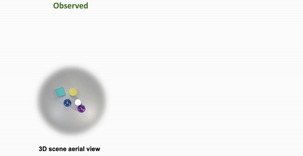
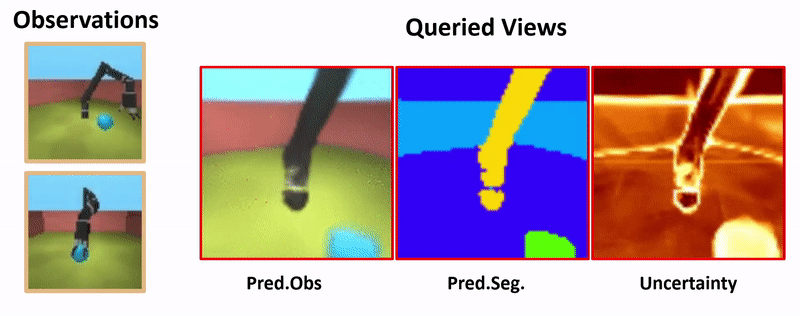

# MulMON  


This repository contains a PyTorch implementation of the [paper:  
**Learning Object-Centric Representations of Multi-object Scenes from Multiple Views**](https://papers.nips.cc/paper/2020/hash/3d9dabe52805a1ea21864b09f3397593-Abstract.html)  
[**Li Nanbo**](http://homepages.inf.ed.ac.uk/s1601283/),
[**Cian Eastwood**](http://homepages.inf.ed.ac.uk/s1668298/),
[**Robert B. Fisher**](https://homepages.inf.ed.ac.uk/rbf/)  
NeurIPS 2020 (**<font style="color:red">Spotlight</font>**)  


## Working examples  
<p float="left">
      
      
    
</p>
Check our video presentation for more: https://youtu.be/Og2ic2L77Pw.


## Requirements
**Hardware**:   
* GPU. Currently, at least one GPU device is required to run this code, however, we will consider adding CPU demo code in the future.
* Disk space: we do NOT have any hard requirement for the disk space, this is totally data-dependent. To use all the datasets we provide, you will need ~9GB disk space. However, it is not necessary to use all of our datasets (or even our datasets), see [Data](#data) section for more details.


**Python Environement**:  
1. We use Anaconda to manage our python environment. Check conda installation guide here: https://docs.anaconda.com/anaconda/install/linux/.

2. Open a new terminal, direct to the MulMON directory:
```path
cd <YOUR-PATH-TO-MulMON>/MulMON/
```
create a new conda environment called "<font style="color:blue">mulmon</font>" and then activate it:
```setup
conda env create -f ./conda-env-spec.yml  
conda activate mulmon
```

3. Install a gpu-supported PyTorch (tested with PyTorch 1.1, 1.2 and 1.7). It is very likely that there exists a PyTorch installer that is compatible with both your CUDA and this code. Go find it on [PyTorch official site](https://pytorch.org/), and install it with one line of command.

4. Install additional packages:
```setup
pip install tensorboard  
pip install scikit-image
```
If pytorch <=1.2 is used, you will also need to execute: ```pip install tensorboardX``` and import it in the `./trainer/base_trainer.py` file. This can be done by commenting the **4th line** AND uncommenting the **5th line** of that file.


## Data
* **Data structure** (*important*):  
  We use a data structure as follows:
  ```
  <YOUR-PATH>                                          
      ├── ...
      └── mulmon_datasets
            ├── clevr                                   # place your own CLEVR-MV under this directory if you go the fun way
            │    ├── ...
            │    ├── clevr_mv            
            │    │    └── ... (omit)                    # see clevr_<xxx> for subdirectory details
            │    ├── clevr_aug           
            │    │    └── ... (omit)                    # see clevr_<xxx> for subdirectory details
            │    └── clevr_<xxx>
            │         ├── ...
            │         ├── data                          # contains a list of scene files
            │         │    ├── CLEVR_new_#.npy          # one .npy --> one scene sample
            │         │    ├── CLEVR_new_#.npy       
            │         │    └── ...
            │         ├── clevr_<xxx>_train.json        # meta information of the training scenes
            │         └── clevr_<xxx>_test.json         # meta information of the testing scenes  
            └── GQN  
                 ├── ...
                 └── gqn-jaco                 
                      ├── gqn_jaco_train.h5
                      └── gqn_jaco_test.h5
  ```
  We recommend one to get the necessary data folders ready before downloading/generating the data files:
  ```prepare
  mkdir <YOUR-PATH>/mulmon_datasets  
  mkdir <YOUR-PATH>/mulmon_datasets/clevr  
  mkdir <YOUR-PATH>/mulmon_datasets/GQN
  ```

* **Get Datasets**  
  * **Easy way**:  
    Download our datasets:  
      * [clevr_mv.tar.gz](https://drive.google.com/file/d/1P8Upanh7yan3kKdnNAtXpa6uC1819hUO/view?usp=sharing) and place it under the `<YOUR-PATH>/mulmon_datasets/clevr/` directory (~1.8GB when extracted).  
      * [clevr_aug.tar.gz](https://drive.google.com/file/d/1dL_YeGSINghTTHoOd8gjbSMm2u5CagJa/view?usp=sharing) and place it under the `<YOUR-PATH>/mulmon_datasets/clevr/` directory (~3.8GB when extracted).  
      * [gqn_jaco.tar.gz](https://drive.google.com/file/d/1ekKa8gCaeqSG0yhr8j6ppR4eCZHECipA/view?usp=sharing) and place it under the `<YOUR-PATH>/mulmon_datasets/GQN/` directory (~3.2GB when extracted).  

    and extract them in places. For example, the command for extracting `clevr_mv.tar.gz`:
    ```
    tar -zxvf <YOUR-PATH>/mulmon_datasets/clevr/clevr_mv.tar.gz -C <YOUR-PATH>/mulmon_datasets/clevr/
    ```
    Note that: 1) we used only a subset of the DeepMind GQN-Jaco dataset, more available at [deepmind/gqn-datasets](https://github.com/deepmind/gqn-datasets), and 2) the published clevr_aug dataset differs slightly from the CLE-Aug used in the paper---we added more shapes (such as dolphins) into the dataset to make the dataset more interesting (also more complex). 

  * **Fun way**  :  
   Customise your own multi-view CLEVR data. (**available soon...**)  
    <!-- For multi-view CLEVR datasets, customisation is highly recommended (more fun!). An easy setup (follow the instructions in [CLEVR-MultiView repository](https://github.com/NanboLi/CLEVR-MultiView) will allow you to customise scenes and generate your own multi-view CLEVR datasets. -->


## Pre-trained models  
[Download the pretrained models](https://drive.google.com/file/d/1qc7uBHHxPmQe7qZJhtnh6SWwojT4pScj/view?usp=sharing) (&leftarrow; click) and place it under `MulMON/', i.e. the root directory of this repository, then extract it by executing: ```tar -zxvf ./logs.tar.gz```. Note that some of them are slightly under-trained, so one could train them further to achieve better results ([How to train?](#usage)).

## Usage
**Configure data path**  
To run the code, the data path, i.e. the `<YOUR-PATH>` in a script, needs to be correctly configured. For example, we store the MulMON dataset folder `mulmon_datasets` in `../myDatasets/`, to train a MulMON on GQN-Jaco dataset using a single GPU, the **4th line** of the `./scripts/train_jaco.sh` script should look like:
`data_path=../myDatasets/mulmon_datasets/GQN`.

* **Demo** (Environment Test)  
  Before running the below code, make sure the pretrained models are downloaded and saved [first](#pre-trained-models):
  ```run
  . scripts/demo.sh  
  ```
  Check `./logs` folder for the generated demos.  

  * **Notes for disentanglement demos**: we randomly pick one object for each scene to create the disentanglement demo, so for scene samples where an empty object slot is picked, you won't see any object manipulation effect in the corresponding gifs (especially for the GQN-Jaco scenes). To create a demo like the shown one, one needs to specify (hard-coding) an object slot of interest and traverse informative latent dimensions (as some dimensions are redundant---capture no object property).

* **Train**  
  * On a single gpu (e.g. using the GQN-Jaco dataset):  
  ```run
  . scripts/train_jaco.sh  
  ```
  * On multiple GPUs (e.g. using the GQN-Jaco dataset):  
  ```run
  . scripts/train_jaco_parallel.sh  
  ```  
  * To resume training from a stopped session, i.e. saved weights `checkpoint-epoch<#number>.pth`, simply append a flag `--resume_epoch <#number>` to one of the flags in the script files.  
  For example, to resume previous training (saved as `checkpoint-epoch2000.pth`) on GQN-Jaco data, we just need to reconfigure the **10th line** of the `./scripts/train_jaco.sh` as:  
  `--input_dir ${data_path} --output_dir ${log_path} --resume_epoch 2000 \`.


* **Evaluation**  
  * On a single gpu (e.g. using the Clevr_MV dataset):  
  ```run
  . scripts/eval_clevr.sh  
  ```  
  * Here is a list of imporant evaluation settings which one might wants to play with  
     `--resume_epoch` specify a model to evaluate
     `--test_batch` how many batches of test data one uses for evaluation.  
     `--vis_batch` how many batches of output one visualises (save) while evaluation. (note: <= `--test_batch`)  
     `--analyse_batch` how many batches of latent codes one saves for a post analysis, e.g. disentanglement. (note: <= `--test_batch`)  
     `--eval_all` (boolean) set **True** for all \[`--eval_recon`, `--eval_seg`, `--eval_qry_obs`, `--eval_qry_seg`\] items, one could also use each of the four independently.   
     `--eval_dist` (boolean) save latent codes for disentanglement analysis. (note: not controlled by `--eval_all`)  
  * For the disentanglement evaluation, run the `scripts/eval_clevr.sh` script with `--eval_dist` flag set to **True** and set the `--analyse_batch` variable (which controls how many scenes of latent codes one wants to analyse) to be **greater than 0**. This saves the ouptut latent codes and ground-truth information that allows you to conduct disentanglement quantification using the [QEDR framework](https://github.com/cianeastwood/qedr.git).  
  * You might observe that the evaluation results on the CLE-Aug dataset differ form those on the original paper, this is because the CLE-Aug here is slightly different the one we used for the paper ([see more details](#data)).  


## Contact
We constantly respond to the raised ''issues'' in terms of running the code. For further inquiries and discussions (e.g. questions about the paper), email: **nanbo.li@ed.ac.uk**.   


## Cite  
Please cite our paper if you find this code useful.
```latex
@inproceedings{nanbo2020mulmon,
  title={Learning Object-Centric Representations of Multi-Object Scenes from Multiple Views},
  author={Nanbo, Li and Eastwood, Cian and Fisher, Robert B},
  booktitle={Advances in Neural Information Processing Systems},
  year={2020}
}
```
