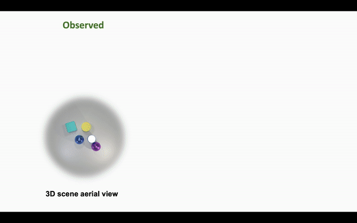

# MulMON

#### (to be released soon ...)

This repository contains a PyTorch implementation of the [paper:  
**Learning Object-Centric Representations of Multi-object Scenes from Multiple Views.  
Li Nanbo, Cian Eastwood, Robert B. Fisher**](https://github.com/NanboLi/MulMON)  
NeurIPS 2020 (**Spotlight**)

## Working Examples

    

